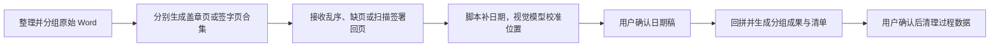

# 债券底稿签署页处理 Skill

[](https://github.com/Vvvvvhhhhh-21321/processing-bond-seal-pages/releases/latest)
[](LICENSE)

这是一个面向债券项目底稿的 Codex Skill。用户只需说明原始 Word、签署回页或现有项目的位置，即可用自然语言完成文件分组、签署页准备、乱序回页匹配、Times New Roman 日期补齐、视觉校准、确认回拼和项目清理。

当前正式版本为 [`v1.1.0`](https://github.com/Vvvvvhhhhh-21321/processing-bond-seal-pages/releases/tag/v1.1.0)。这一版本将原有批次脚本升级为可续接的项目工作流，并加入分组成果、重复签署页复用、处理数据补建和视觉日期校准。

当前只处理“每份 Word 的最后一页是唯一签署页”的底稿文件，不处理一份文件包含多张签字页的发行文件，也不判断印章真伪或签字人身份。

## 工作流一览



## 能力

- 分开处理发行人说明性文件和项目组分析文件，也支持只有其中一组。
- 初始化项目框架并把原始 `.doc`/`.docx` 移入对应“原始Word”目录。
- 分别生成发行人待盖章页合集和项目组签字页合集。
- 可选择每份单独签署，或让同组 SHA-256 完全相同的 Word 复用一张签署页。
- 重复 Word 只减少实际签署页数量，每份 Word 仍生成独立最终 PDF。
- 支持乱序、缺页、文字页和扫描签署回页，通过标题识别与保存映射完成回拼。
- 日期先由确定性脚本落字，新增数字使用真正的 Times New Roman。
- 支持图像输入时，由模型逐页给出“通过、需调整、无法判断”三态结论并只调整日期数字坐标；最多五轮，无法判断或安全校验失败时恢复脚本初始页。
- 不支持图像输入时跳过模型检查，并将所有补字页标记为人工重点核对。
- 支持从已有项目自动续接，不重复可靠阶段。
- 只有当前 Word 和已返回签署页时，可以补建处理数据并重新匹配。
- 用户确认项目彻底完成后，可把技术处理数据移入系统回收站。

## 推荐模型

推荐 GPT-5.6 Sol medium；成本优先时可使用 GPT-5.6 Terra xhigh。在 WorkBuddy 中，也可使用 Kimi K3。应优先选择具备图像输入能力的实际模型。

模型和推理档位是推荐配置，不是 Skill 元数据可以强制的硬门槛。没有图像输入能力时，确定性脚本流程仍可运行，但日期补字页必须人工核对。

## 安装

仓库中可直接安装的 Skill 位于：

```text
.agents/skills/processing-bond-seal-pages/
```

把这个完整目录复制到本机 Codex Skills 目录，并保留其中的 `SKILL.md`、`agents/`、`references/` 和 `scripts/`。安装后重新打开任务，即可通过 `$processing-bond-seal-pages` 显式调用；提到盖章页、签字页、回章、回签、日期确认或回拼时也会自动触发。

## 使用方式

调用 `$processing-bond-seal-pages`，直接说明你现有的材料。例如：

```text
请处理这个债券项目。发行人说明性文件在“发行人说明文件”目录，
项目组分析文件在“项目组分析文件”目录，项目名叫“示例债券”。
```

```text
我已经收到发行人回章 PDF，请从现有签署页处理项目继续。
```

```text
原来的处理数据丢了。我现在只有原始 Word 和客户返回的盖章页，请补建后继续。
```

用户不需要输入底层命令。Skill 会说明当前阶段、将执行的文件移动、需要选择的重复策略、日期确认稿位置、重点页以及下一次确认。

## 项目结构

项目可以只有一个签署文件组；以下展示双组完整结构：

```text
<项目名>_签署页处理/
├─ 发行人说明性文件/
│  ├─ 原始Word/
│  ├─ <项目名>_发行人待盖章页合集.pdf
│  ├─ <项目名>_发行人回章原件.pdf
│  ├─ <项目名>_发行人日期确认稿.pdf
│  ├─ <项目名>_发行人盖章版底稿/
│  └─ <项目名>_发行人处理清单.html
├─ 项目组分析文件/
│  ├─ 原始Word/
│  ├─ <项目名>_项目组签字页合集.pdf
│  ├─ <项目名>_项目组回签原件.pdf
│  ├─ <项目名>_项目组日期确认稿.pdf
│  ├─ <项目名>_项目组签字版底稿/
│  └─ <项目名>_项目组处理清单.html
├─ 项目状态_project.json
└─ 处理数据_请勿删除/
   ├─ 发行人说明性文件/
   └─ 项目组分析文件/
```

完整底稿 PDF、页面映射、日期确认清单和视觉调整记录集中在处理数据目录。用户可见成果使用中文业务名称；最终 PDF 会去掉 `.doc/.docx` 扩展。

## 两个确认关口

1. 日期确认稿生成并完成视觉复核后，Skill 暂停。用户可以人工修改 PDF，但不能增删页面或改变页面顺序。明确确认后才回拼。
2. 所有实际存在的签署文件组完成后，Skill 另行询问是否清理。确认后只把“处理数据_请勿删除”移入系统回收站；根目录的小型项目状态文件保留，用于记录已清理状态。

日期确认不会自动授权清理。原始 Word、签署页合集、签署回页原件、日期确认稿、最终底稿和处理清单不会被清理。

## 日期安全边界

- 日期值、Times New Roman、字号、颜色由脚本锁定。
- 模型只能调整脚本新增数字的横纵坐标。
- 每轮都从原始签署回页重新生成，不在上一轮结果上叠加。
- 工具检查坐标范围、日期调整区域、原页文字碰撞、数字相互碰撞、页面数量、页面尺寸和 PDF 可读性。
- 五轮仍未确认时恢复脚本初始位置并标记人工复核。

## 恢复与变化检测

重新调用 Skill 时，会读取项目状态并报告各组“已完成、待继续、需确认”。已经完成且校验一致的阶段不会重跑。

如果原始 Word 在处理中发生新增、修改或缺失，Skill 会暂停并列出变化。用户确认后只补建受影响组，重新匹配现有签署回页，再执行日期和确认流程。补建会明确提示：无法证明当前 Word 与当初送签版本的版式完全一致。

## 运行环境

- Windows：使用本机 Microsoft Word 转换 `.doc/.docx`。
- macOS：使用 LibreOffice 无界面转换。
- 日期与 PDF 处理需要 Python、pypdf、pdfplumber、ReportLab、Pillow、pypdfium2、NumPy 和 OpenCV。
- 扫描标题识别需要 RapidOCR、ONNX Runtime 与 PP-OCRv6 small。
- 系统必须安装真正的 Times New Roman 常规字体；不会自动用近似字体替代。

环境检查和安装计划由内部脚本生成。任何安装都会先向用户说明目标 Python 和影响，并取得同意；不会静默创建额外环境或同时修改多个 Python。

## 开发验证

自动化测试位于 Skill 的 `scripts/tests` 开发目录，覆盖项目初始化、分组、重复页复用、Times New Roman、日期确认、视觉坐标、续接、补建、回拼、清理及原有 OCR/PDF 能力。

真实 Word 转换和完整项目验收需要在相应平台设置本地样本路径后运行条件式冒烟测试。

## License

MIT
